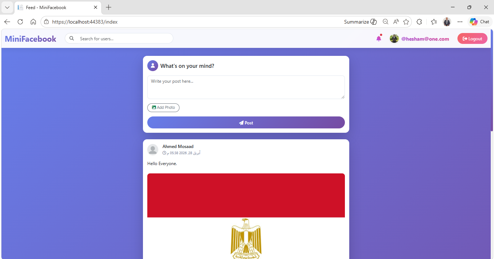
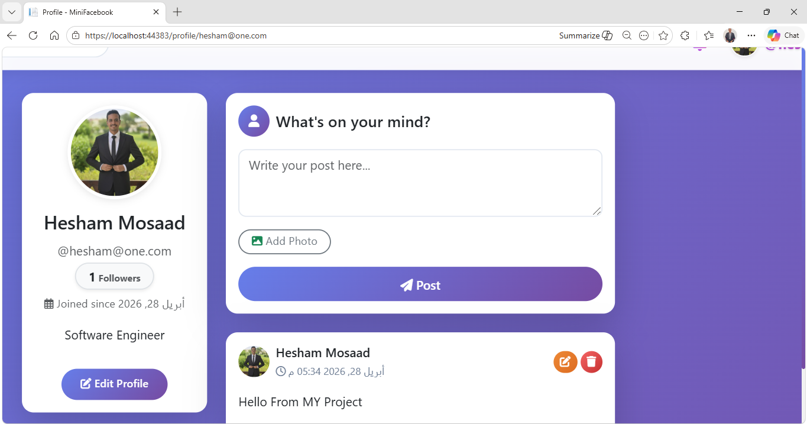
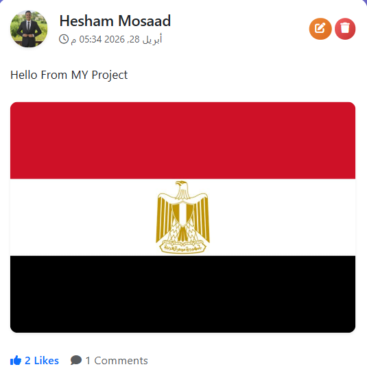
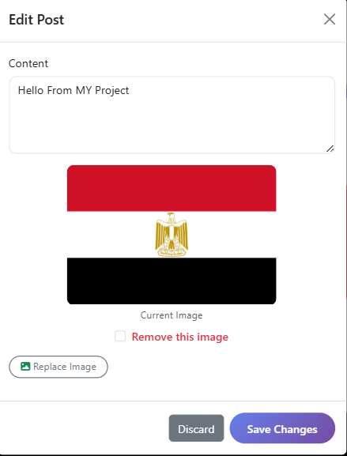
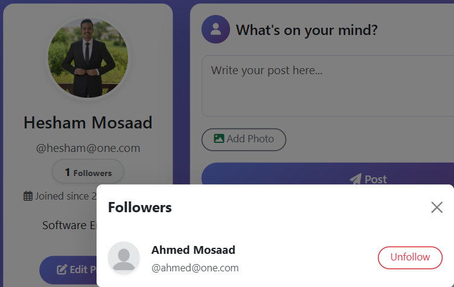
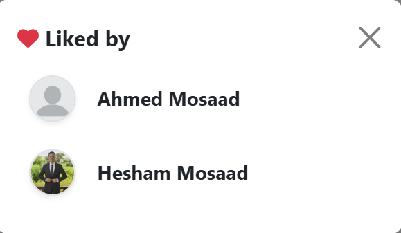
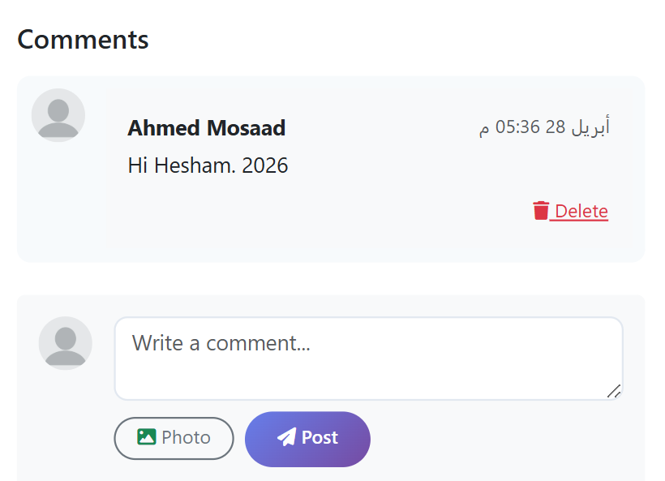

# 🚀 MiniFacebook

A simple social media web application built using ASP.NET Core Razor Pages.  
This project demonstrates building a mini social platform with authentication, user interaction, and content management.

---

## 🎯 Project Overview

MiniFacebook is a learning-based project that simulates core features of a social media platform such as posting, user profiles, and authentication.

The goal of this project is to practice backend development using ASP.NET and Entity Framework Core while applying real-world concepts.

---

## ✨ Features

- 🔐 User Registration & Login (Authentication)
- 👤 User Profile Page
- 🧑 Edit Profile
- 📰 News Feed displaying posts
- 📝 Create, Edit, and Delete Posts
- 🗑️ Delete Post
- 📸 Upload/Replace Post Images
- 🔎 Find Users
- 👥 Followers System
- ❤️ Like Posts (Liked By users)
- 💬 Comments System
- 🔔 Notifications System
- 🧠 Clean and simple UI using Razor Pages

---

## 🛠️ Tech Stack

- ASP.NET Core Razor Pages
- Entity Framework Core
- SQL Server / SQLite
- C#
- Bootstrap (for UI)

---

## 📷 Screenshots

### 🏠 Home Page


### 👤 Profile Page


### ✏️ Edit Profile


### 📝 Create Post


### ✏️ Edit Post


### 🔎 Find Users


### 👥 Followers


### ❤️ Liked By


### 💬 Comments


### 🗑️ Delete Post


### 🔔 Notifications


---

## ⚙️ Getting Started

### 1. Clone the repository
```bash
git clone https://github.com/HESHAM-MOSA3D/MiniFacebook.git
cd MiniFacebook
